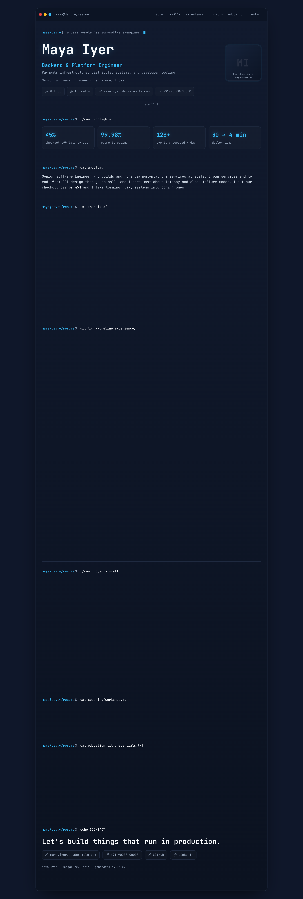
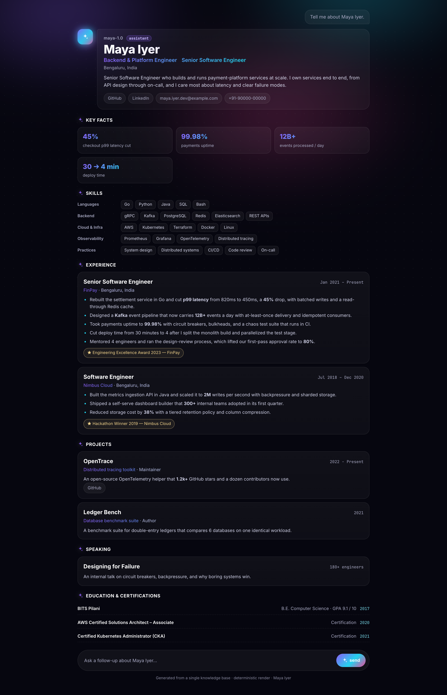
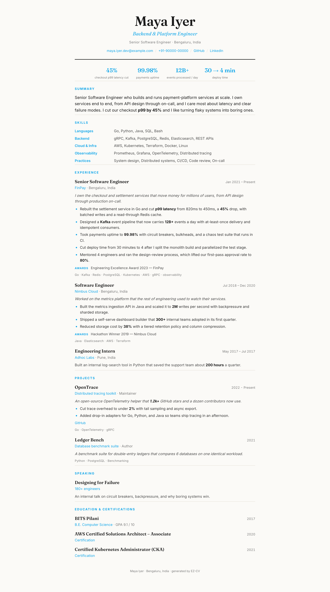
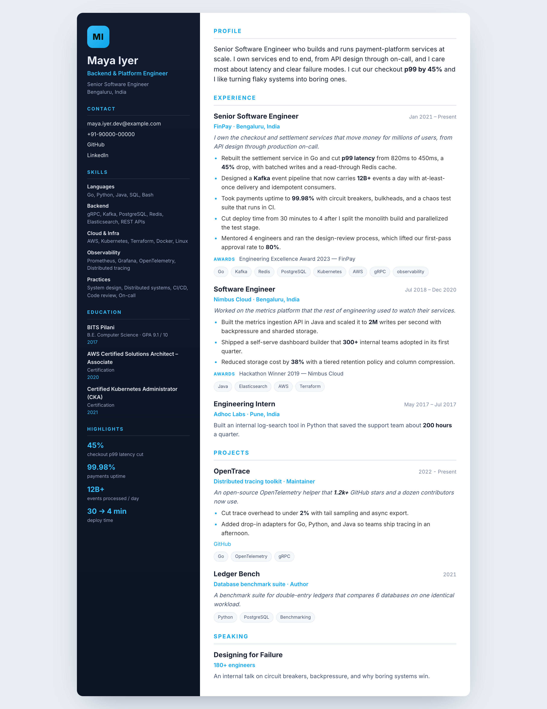

<div align="center">

# EZ-CV

### A resume builder that interviews you, then builds you a resume *and* a personal resume skill you keep.

[](LICENSE)
[](https://www.python.org/)
[](#what-you-get)
[](#what-makes-it-good)

**[See a live resume built with EZ-CV →](https://khusharm4699.github.io/)**

</div>

---

## Why this exists

I built this for myself. I had years of work to put into a resume, kept fighting
with formatting, and every "AI resume" I tried either fabricated things or wrote
prose that screamed *generated by a robot*. So I made a small engine: one verified
file of facts, deterministic renderers, and a humanizer that refuses to ship
robotic copy.

Then I realized other people hit the same wall — especially folks who don't know
where to start. So EZ-CV doesn't just render a resume; it **interviews you** one
question at a time, never invents anything, and hands you a **personal resume
skill** you can re-run forever. Change a number, re-run, every format updates.

That live link above is my own resume, generated by this exact engine.

## What makes it good

| Feature | What it means for you |
|---|---|
| **ATS-friendly, high-scoring** | Markdown + LaTeX/PDF are single-column, plain-unicode, standard headings, quantified bullets — the format parsers actually read. |
| **Humanized prose** | A deterministic AI-fingerprint scan (banned words, robotic `-ing` bullet endings, em-dash spam, monotonous sentences, passive voice) must **pass** before anything is called done. |
| **Four HTML resume styles** | A scrolling terminal theme, an AI-assistant chat-UI one-pager, a light print-grade editorial layout, and a modern two-column sidebar — all self-contained single files from the same data. Pick per role. |
| **Every format, one source** | HTML, Markdown, LaTeX, PDF — full and one-page — all from a single `profile.json`. Edit once, regenerate all. |
| **No hallucination** | The interview never guesses. Unknown facts are marked, never invented. Your numbers stay your numbers. |
| **Auto-bolded impact** | Metrics (`45%`, `12B+`, `30 → 4 min`) and the phrases you choose get bolded automatically across every format. |
| **Themable** | One accent color in `profile.json` recolors all four HTML styles and the PDF at once. |
| **Token-light** | Rendering is plain Python — no model calls. The AI is only used to help you *write*, never to re-render. |

## What you get

**Four HTML styles, one `profile.json`.** Same verified facts, four very different
looks — the screenshots below are the included fictional example (*Maya Iyer*),
rendered by this exact engine:

| Terminal | AI-assistant |
|:---:|:---:|
| [](https://khusharm4699.github.io/terminal.html) | [](https://khusharm4699.github.io/ai.html) |
| Scrolling dev-console aesthetic | Your story as a chat with an AI, tool-call cards |

| Editorial | Sidebar |
|:---:|:---:|
| [](https://khusharm4699.github.io/editorial.html) | [](https://khusharm4699.github.io/sidebar.html) |
| Light, print-grade, recruiter-friendly | Modern two-column with accent rail |

**Live examples** (my own resume, generated by EZ-CV):
[Terminal](https://khusharm4699.github.io/terminal.html) ·
[AI-assistant](https://khusharm4699.github.io/ai.html) ·
[Editorial](https://khusharm4699.github.io/editorial.html) ·
[Sidebar](https://khusharm4699.github.io/sidebar.html) ·
[PDF](https://khusharm4699.github.io/khush_sharma_resume.pdf)

…plus ATS Markdown, LaTeX, and one-page variants of each.

## Built with EZ-CV — my own résumé

The example above is fictional. Here is the **real thing**: my own résumé, the same
four styles, generated by this exact engine and live on GitHub Pages. Click any image
to open the live page.

| Terminal | AI-assistant |
|:---:|:---:|
| [](https://khusharm4699.github.io/terminal.html) | [](https://khusharm4699.github.io/ai.html) |

| Editorial | Sidebar |
|:---:|:---:|
| [](https://khusharm4699.github.io/editorial.html) | [](https://khusharm4699.github.io/sidebar.html) |

**[Open the live site →](https://khusharm4699.github.io/)** — same `profile.json`, four
looks, one click each.

## How it works

```
  Interview (one question at a time, no assumptions)
        │
        ▼
  data/profile.json   ← your single verified source of truth
        │
        ▼
  scaffold.py  →  a personal resume skill that is yours to keep
        │
        ▼
  Renderers  →  4 HTML styles · Markdown · LaTeX · PDF   (full + one-page)
        │
        ▼
  humanize_scan.py  →  must print PASS before you ship
```

## Quickstart

```bash
git clone https://github.com/Khusharm4699/ez-cv.git
cd ez-cv

# Option A — try it on the included fictional example
cd template
python3 scripts/build_html.py            # terminal  -> output/maya_iyer_resume.html
python3 scripts/build_html_ai.py         # AI-assistant one-pager
python3 scripts/build_html_editorial.py  # light, print-grade
python3 scripts/build_html_sidebar.py    # modern two-column
python3 scripts/build_text.py            # ATS Markdown + LaTeX
cd output && tectonic maya_iyer_resume.tex   # -> PDF (needs tectonic or pdflatex)

# Option B — build your own
python3 scripts/interview.py         # see the question bank
# ...answer the questions, write your data/profile.json...
python3 scripts/scaffold.py --name "Your Name" --profile your_profile.json
```

Using it inside Cursor? Drop the repo into `~/.cursor/skills/ez-cv` and say
**"ez-cv"** or **"build my resume"** — the agent runs the interview, fills in your
`profile.json`, scaffolds your personal skill, and renders everything.

## Repository layout

```
ez-cv/
├── SKILL.md                 # the EZ-CV meta-skill (interview → scaffold)
├── scripts/
│   ├── interview.py         # the question bank the interview follows
│   └── scaffold.py          # clones the template into your personal skill
├── template/                # the per-user skill that gets cloned
│   ├── SKILL.md             # the resume-builder skill you keep
│   ├── data/
│   │   ├── profile.json         # a worked fictional example (runs out of the box)
│   │   ├── profile.example.json # pristine copy of the example
│   │   └── profile.schema.json  # every field, documented
│   ├── scripts/             # build_html (terminal), build_html_ai, build_html_editorial,
│   │                        #   build_html_sidebar, build_text, _condense, _emphasis,
│   │                        #   _identity, humanize_scan, keyword_audit
│   └── reference/           # the writing playbooks (quantify, humanize, JD, critique)
└── examples/
    └── example_profile.json
```

## Design principles

- **Deterministic first, model second.** Python renders; the model only helps you
  write and critique.
- **One source of truth.** All formats come from `profile.json`. No drift.
- **Honesty over polish.** Gaps are flagged and closed with real work, never faked.

## Contributing

Issues and PRs welcome — new themes, renderers, and humanizer rules especially.
Keep the renderers deterministic and dependency-free.

## License

[MIT](LICENSE) © Khush Sharma
